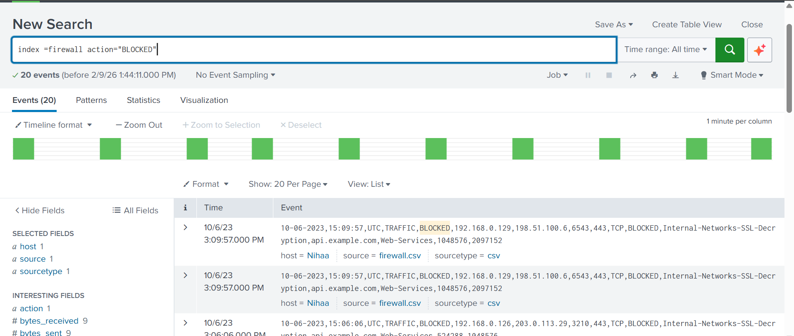
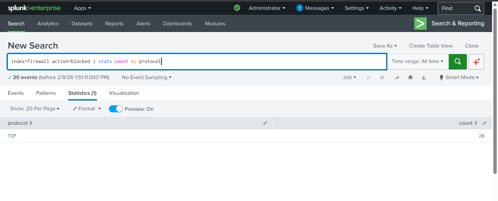
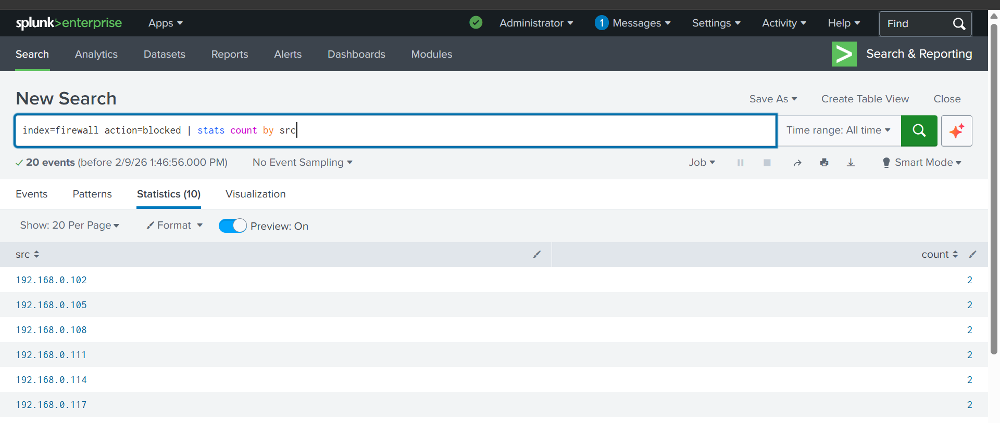
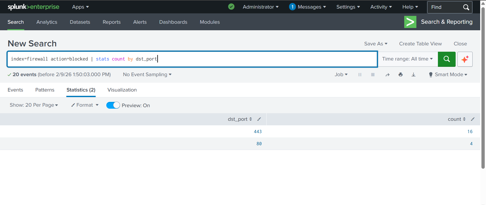
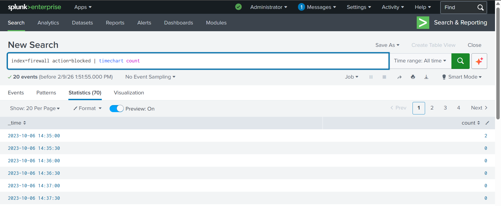
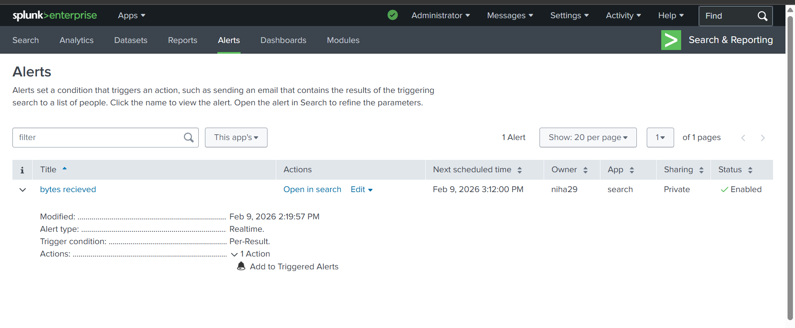
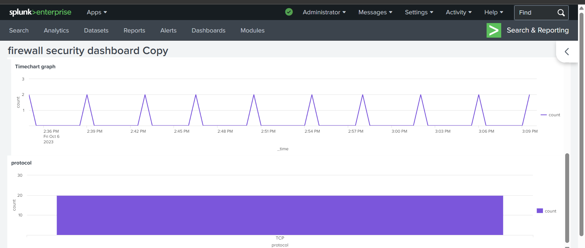
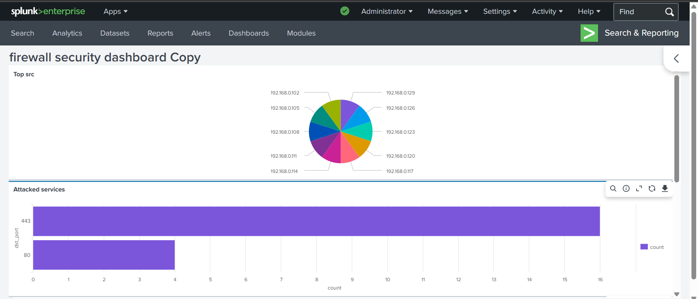

# Splunk Firewall Log Monitoring

## Project Overview
Analyzed firewall CSV logs using Splunk to detect blocked traffic, identify suspicious IPs/ports, and build dashboards and alerts for proactive monitoring.

## Data Source
Firewall logs in CSV format.

## Features
- CSV log ingestion
- Blocked traffic analysis
- Top attacker identification
- Port and protocol analysis
- Dashboard visualization
- Alert creation for suspicious activity

## Sample Queries

## show blocked traffic
index=firewall action=block | stats count 
## count by source ip
index=firewall action=block | stats count by src
## Timechart of Attack Trend
index=firewall action=block | timechart count

## 📊 Screenshots & Results

### Blocked Traffic Detection

### Protocol Analysis

### Top Source IPs (Attackers)

### Target Ports Analysis

### Traffic Timeline

### Alerts Overview

### Firewall Dashboard

### Firewall Dashboard

## Outcome
Identified malicious IP addresses and visualized firewall security events using Splunk dashboards and alerts.